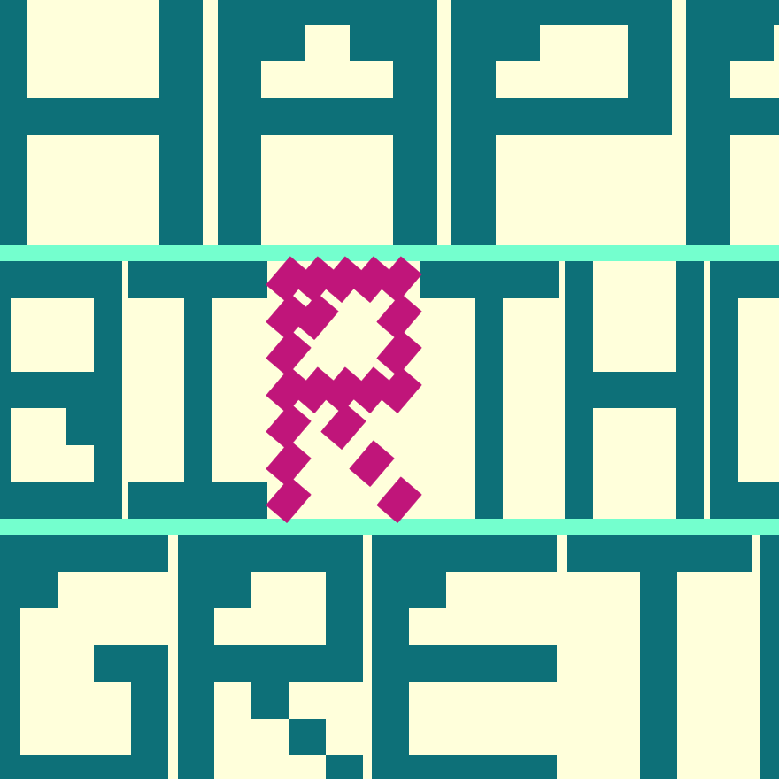
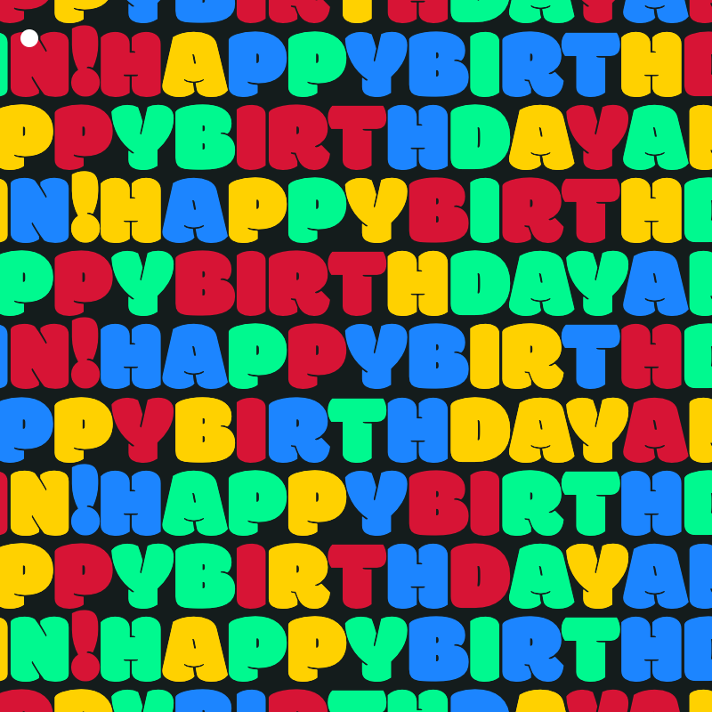
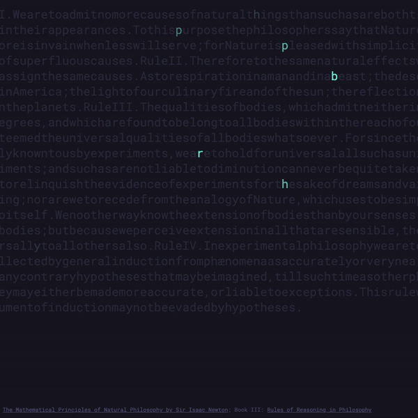

  <h1 class="page-title">Code Cards</h1>

  <section class="list-wrapper">
    <ul class="list-mc">
      <li class="list-mc__item">
        
        

          
<a class="btn" href="https://codepen.io/ChrisBup/live/abwmEze" target="_blank" rel="noopener">View Code Card</a>

        

      </li>
      <li class="list-mc__item">
        
        

          
<a class="btn" href="https://codepen.io/ChrisBup/live/zYzBKOY" target="_blank" rel="noopener">View Code Card</a>

        

      </li>
      <li class="list-mc__item">
        
        

          
<a class="btn" href="https://codepen.io/ChrisBup/live/ZEJzZZB" target="_blank" rel="noopener">View Code Card</a>

        

      </li>
      <li class="list-mc__item">
        
        

          
<a class="btn" href="https://codepen.io/ChrisBup/live/GREaZRN" target="_blank" rel="noopener">View Code Card</a>

        

      </li>
      <li class="list-mc__item">
        
        

          
<a class="btn" href="https://codepen.io/ChrisBup/pen/ZEKNEmg" target="_blank" rel="noopener">View Code Card</a>

        

      </li>
      <li class="list-mc__item">
        
        

          
<a class="btn" href="https://codepen.io/ChrisBup/live/zYBNJWa" target="_blank" rel="noopener">View Code Card</a>

        

      </li>
      <li class="list-mc__item">
        
        

          
<a class="btn" href="https://codepen.io/ChrisBup/live/gOaZEad" target="_blank" rel="noopener">View Code Card</a>

        

      </li>
      <li class="list-mc__item">
        
        

          
<a class="btn" href="https://parents-anniversary-codecard-2020.glitch.me/" target="_blank" rel="noopener">View Code Card</a>

        

      </li>
      <li class="list-mc__item">
        
        

          
<a class="btn" href="https://dads-birthday-codecard-2020.glitch.me/" target="_blank" rel="noopener">View Code Card</a>

        

      </li>
      <li class="list-mc__item">
        
        

          
<a class="btn" href="https://codepen.io/ChrisBup/live/ZEWWPmB" target="_blank" rel="noopener">View Code Card</a>

        

      </li>
      <li class="list-mc__item">
        
        

          
<a class="btn" href="https://codepen.io/ChrisBup/live/PoPKjab" target="_blank" rel="noopener">View Code Card</a>

        

      </li>
      <li class="list-mc__item">
        
        

          
<a class="btn" href="https://codepen.io/ChrisBup/live/qBbrPgm" target="_blank" rel="noopener">View Code Card</a>

        

      </li>
      <li class="list-mc__item">
        
        

          
<a class="btn" href="https://codepen.io/ChrisBup/live/gObmPxa" target="_blank" rel="noopener">View Code Card</a>

        

      </li>
      <li class="list-mc__item">
        
        

          
<a class="btn" href="https://gretas-birthday-codecard-2019.glitch.me/" target="_blank" rel="noopener">View Code Card</a>

        

      </li>
      <li class="list-mc__item">
        
        

          
<a class="btn" href="https://anns-birthday-codecard-2019.glitch.me/" target="_blank" rel="noopener">View Code Card</a>

        

      </li>
      <li class="list-mc__item">
        
        

          
<a class="btn" href="https://parents-anniversary-codecard-2019.glitch.me/" target="_blank" rel="noopener">View Code Card</a>

        

      </li>
      <li class="list-mc__item">
        
        

          
<a class="btn" href="https://codepen.io/ChrisBup/live/xoyKwG" target="_blank" rel="noopener">View Code Card</a>

        

      </li>
      <li class="list-mc__item">
        
        

          
<a class="btn" href="https://codepen.io/ChrisBup/live/WaqvQR" target="_blank" rel="noopener">View Code Card</a>

        

      </li>
      <li class="list-mc__item">
        
        

          
<a class="btn" href="https://codepen.io/ChrisBup/live/QZvymK" target="_blank" rel="noopener">View Code Card</a>

        

      </li>
      <li class="list-mc__item">
        
        

          
<a class="btn" href="https://codepen.io/ChrisBup/live/wYMNPK" target="_blank" rel="noopener">View Code Card</a>

        

      </li>
      <li class="list-mc__item">
        
        

          
<a class="btn" href="https://codepen.io/ChrisBup/live/QBqwWL" target="_blank" rel="noopener">View Code Card</a>

        

      </li>
      <li class="list-mc__item">
        
        

          
<a class="btn" href="https://codepen.io/ChrisBup/live/qKRgPB" target="_blank" rel="noopener">View Code Card</a>

        

      </li>
    </ul>
  </section>

