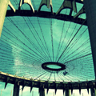
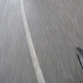

      
  <h1 class="all-caps">Photo</h1>
   
  

    
    
    
    
    
    
    
    
    
    
    
    
    
    
    
    
    
    
    
    
    
    
  

  

    CLOSE (X)
    
    

  

  

  
top

 <!-- .main-content -->
