

  <h1 class="page-title">Side Projects</h1>

  <section class="list-wrapper">
    <ul class="list-mc">
      <li class="list-mc__item">
        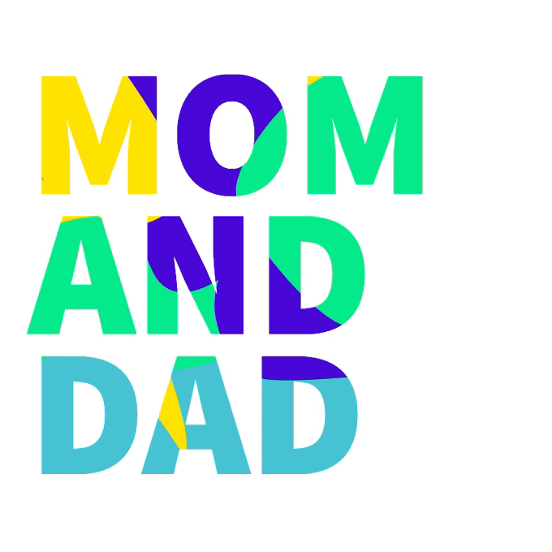
        

          <h3 class="list-mc__title">Code Cards</h3>
          
Sometimes I send a handmade greeting card, sometimes I send a code card.

          
<a class="btn" href="/code-cards" target="_blank" rel="noopener">View Code Cards</a>

        

      </li>
      <li class="list-mc__item">
        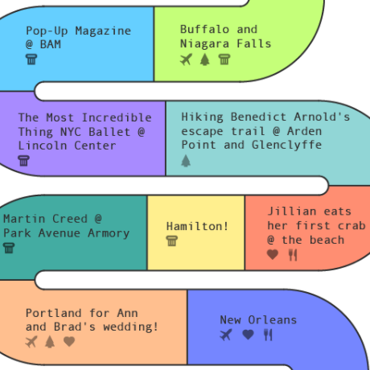
        

          <h3 class="list-mc__title">Holiday Emails</h3>
          
A collection of the holiday email greeting cards my wife and I send out every year.

          
<a class="btn" href="/annual-email" target="_blank" rel="noopener">View Emails</a>

        

      </li>
      <li class="list-mc__item">
        
        

          <h3 class="list-mc__title">Wall of Fame</h3>
          
My wall of fame is just some photos of amazing people and me!

          
<a class="btn" href="/wall-of-fame" target="_blank" rel="noopener">View Photos</a>

        

      </li>
      <li class="list-mc__item">
        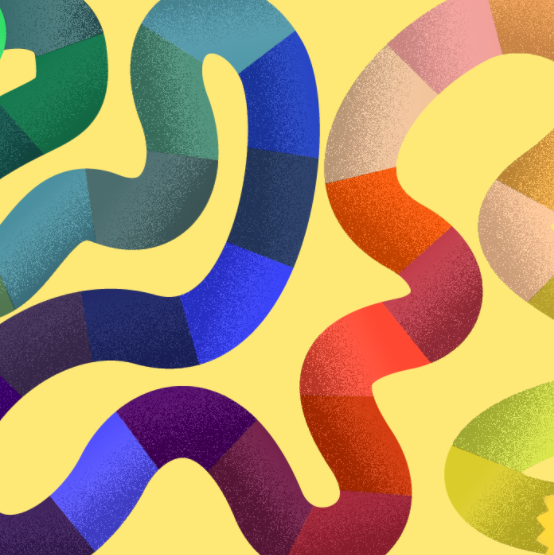
        

          <h3 class="list-mc__title">Roll-A-Fun</h3>
          
A very prototype, desktop-only, screen share board game to play with the whole family over Zoom with trivia specifically for adults and three-year-olds. Two teams: koalas and dolphins. Roll die, answer a question to move that amount. Hover, click on board to move. Click images to enlarge.

          
<a class="btn" href="/roll-a-fun" target="_blank" rel="noopener">View Game</a>

        

      </li>
      <li class="list-mc__item">
        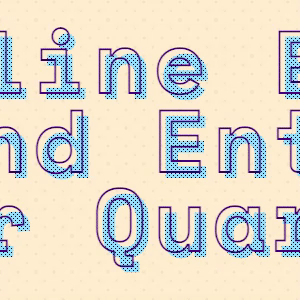
        

          <h3 class="list-mc__title">Quarantainment</h3>
          
A running collection of events, entertainment, and resources available online to help make quarantine life just a little bit better.

          
<a class="btn" href="https://quarantainment.radishlab.com/" target="_blank" rel="noopener">View Site</a>

        

      </li>
      <li class="list-mc__item">
        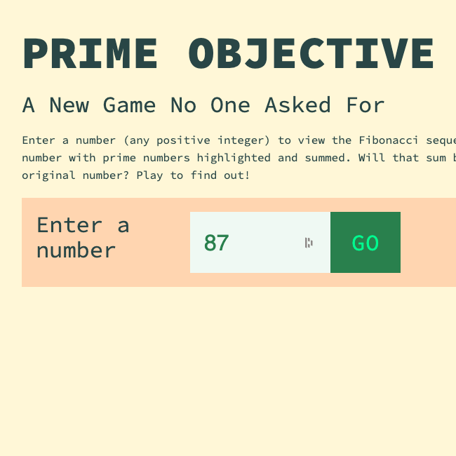
        

          <h3 class="list-mc__title">Prime Objective</h3>
          
A game created for no reason at all.

          
<a class="btn" href="https://codepen.io/ChrisBup/live/XWrpEPx" target="_blank" rel="noopener">View Game</a>

        

      </li>
      <!-- <li class="list-mc__item">
        
        

          <h3 class="list-mc__title">My Travel Site</h3>
          
A chronicle of a few of my most memorable trips.

          
<a class="btn" href="https://travel.chrisheuberger.com/" target="_blank" rel="noopener">View Site</a>

        

      </li> -->
      <li class="list-mc__item">
        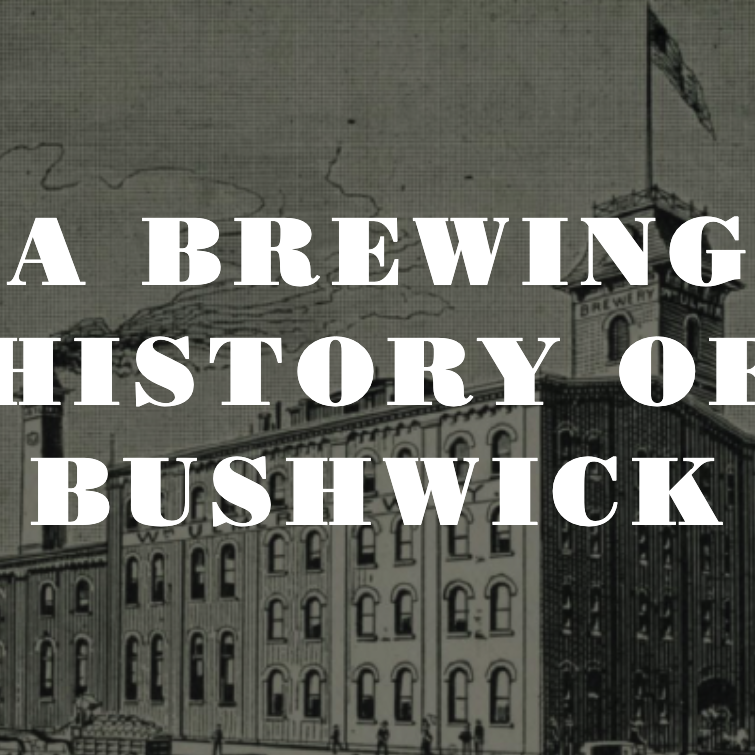
        

          <h3 class="list-mc__title">Bushwick Brewing History Tour</h3>
          
My walking tour on the beer brewing and cultural history of Bushwick, Brooklyn.

          
<a class="btn" href="https://www.bushwickbrewingtour.com" target="_blank" rel="noopener">View Site</a>

        

      </li>
      <li class="list-mc__item">
        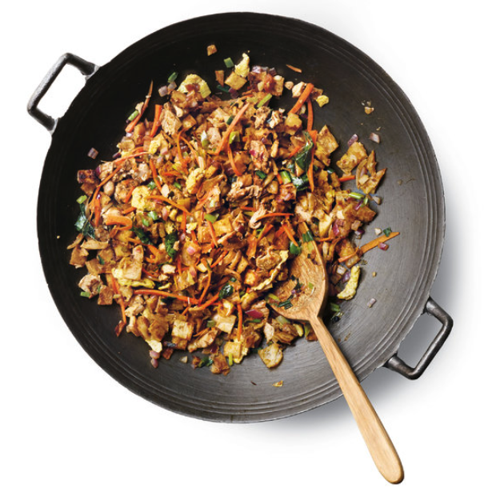
        

          <h3 class="list-mc__title">CookyHero</h3>
          
A list of recipes with ingredient checklists for easy grocery shopping.

          
<a class="btn" href="https://www.cookyhero.com/" target="_blank" rel="noopener">View Site</a>

        

      </li>
      <li class="list-mc__item">
        
        

          <h3 class="list-mc__title">HIIT</h3>
          
A guided high intensity interval training (HIIT) workout with audio commands so I don’t need to look at my phone to see the next exercise.

          
<a class="btn" href="/hiit" target="_blank" rel="noopener">View Site</a>

        

      </li>
      <li class="list-mc__item">
        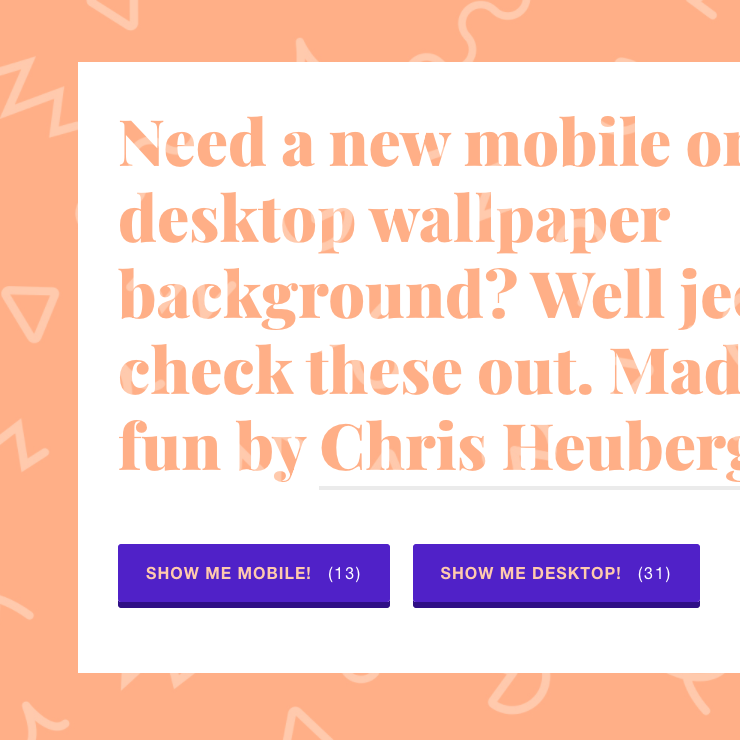
        

          <h3 class="list-mc__title">Pizza is the Best</h3>
          
A collection of desktop backgrounds I designed, hosted at the best domain name I own.

          
<a class="btn" href="https://www.pizzaisthebest.com/" target="_blank" rel="noopener">View Site</a>

        

      </li>
      <li class="list-mc__item">
        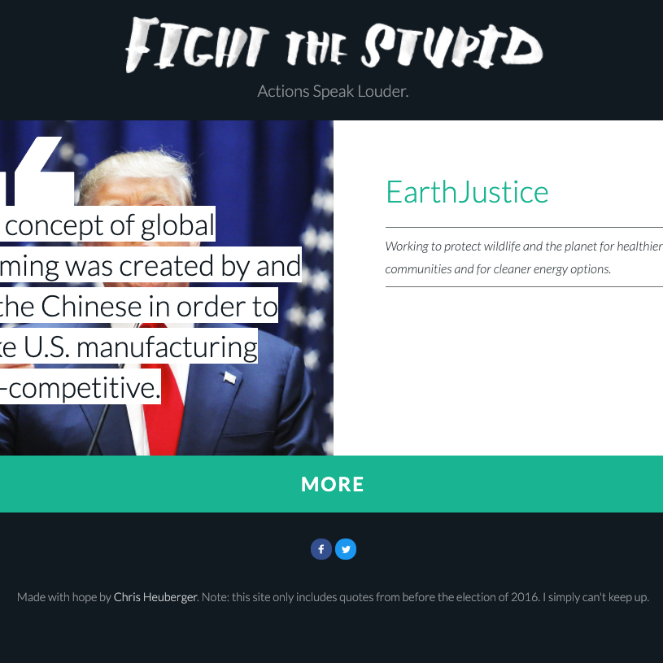
        

          <h3 class="list-mc__title">Fight the Stupid</h3>
          
My political protest site.

          
<a class="btn" href="https://www.fightthestupid.com/" target="_blank" rel="noopener">View Site</a>

        

      </li>
      <li class="list-mc__item">
        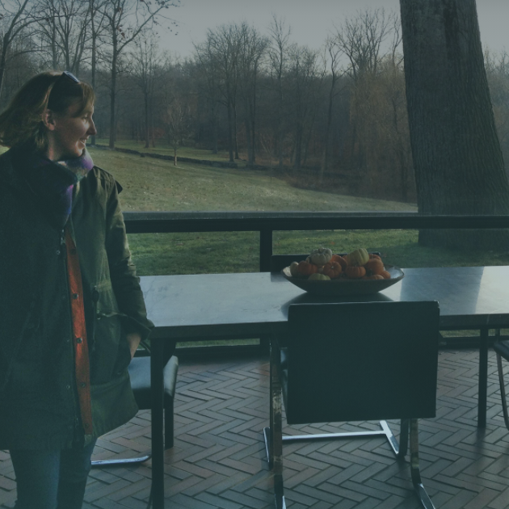
        

          <h3 class="list-mc__title">Jillian Russo Site</h3>
          
Website for my wife, an art art historian and curator.

          
<a class="btn" href="https://jillianelliottrusso.com/" target="_blank" rel="noopener">View Site</a>

        

      </li>
      <li class="list-mc__item">
        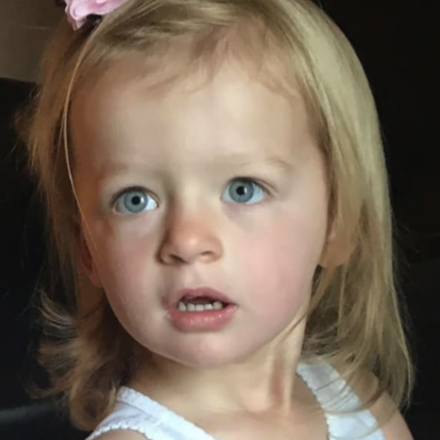
        

          <h3 class="list-mc__title">Jules Ferrin Site</h3>
          
A photo journal for my niece.

          
<a class="btn" href="https://julesferrin.com/" target="_blank" rel="noopener">View Site</a>

        

      </li>
      <li class="list-mc__item">
        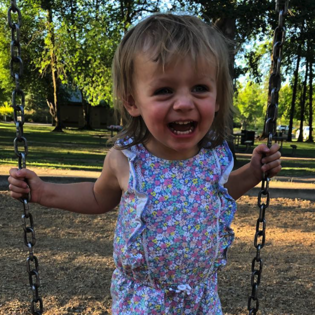
        

          <h3 class="list-mc__title">Greta Ferrin Site</h3>
          
And another one for my other niece.

          
<a class="btn" href="https://gretaferrin.com/" target="_blank" rel="noopener">View Site</a>

        

      </li>
      <li class="list-mc__item">
        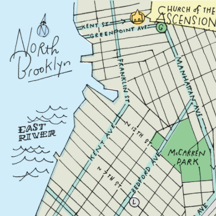
        

          <h3 class="list-mc__title">G Train Love Story</h3>
          
Our wedding website.

          
<a class="btn" href="https://www.gtrainlovestory.com/" target="_blank" rel="noopener">View Site</a>

        

      </li>
    </ul>
  </section>

