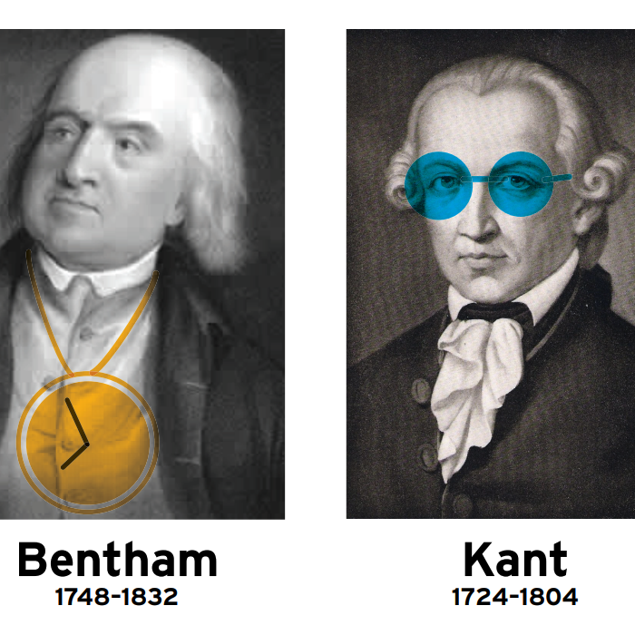
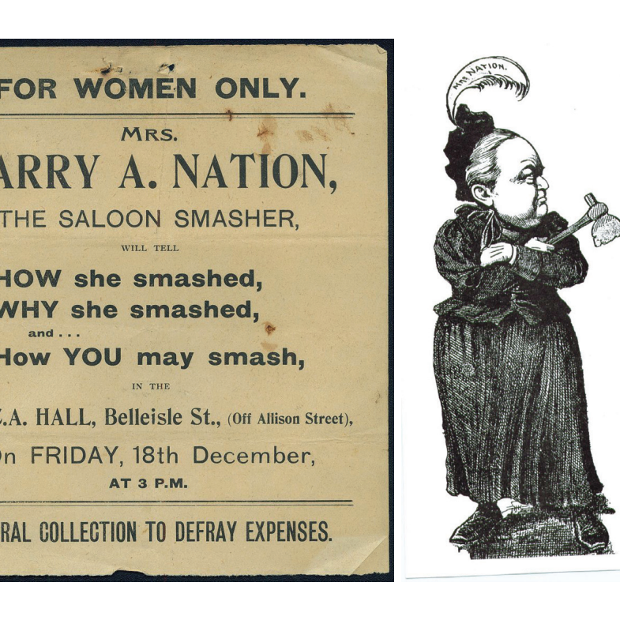
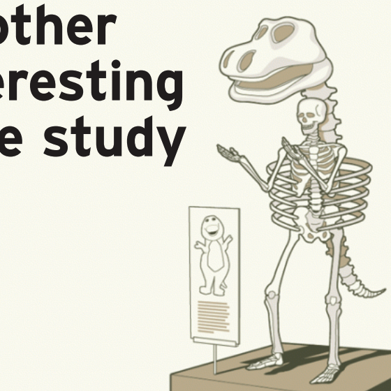

  <h1 class="page-title">Talks</h1>

  <section class="list-wrapper">
    <ul class="simple-list">
      <li class="simple-list__item">
        
        

          <h3 class="simple-list__title">What is a Web Developer?</h3>
          <h6 class="simple-list__date">April 2019</h6>
          
Given as part of <a class="text-link" href="https://wearebcs.org/" target="_blank" rel="noopener">Brooklyn Community Services’</a> Creative Industries Fair at P.S. 284

          
<a class="btn" href="https://docs.google.com/presentation/d/1FEj4kfvNWTE3ViNSXmK3VgzL5J-4_zwEsgzAi213c9k/edit?usp=sharing" target="_blank" rel="noopener">View Deck</a>

        

      </li>
      <li class="simple-list__item">
        
        

          <h3 class="simple-list__title">A Brewing History of Brooklyn</h3>
          <h6 class="simple-list__date">December 2018</h6>
          
A history of New York City’s beer brewing industry, focused on the German immigrant population of Bushwick, Brooklyn.

          
<a class="btn" href="https://docs.google.com/presentation/d/1l42G9SGduDMGT_RvWcthu4fWaKFdEw5-MxS9Ndpxn6A/edit?usp=sharing" target="_blank" rel="noopener">View Deck</a>

        

      </li>
      <li class="simple-list__item">
        
        

          <h3 class="simple-list__title">Moral Dilemmas</h3>
          <h6 class="simple-list__date">October 2011</h6>
          
An overview of the most well-known and much-debated moral quandaries and the philosophical and ethical schools of thought around them.

          
<a class="btn" href="assets/img/presentations/ppn-dilemmas.pdf" target="_blank" rel="noopener">View Deck</a>&ensp;<a class="btn" href="dilemmas.html" target="_blank" rel="noopener">View Notes</a>

        

      </li>
      <li class="simple-list__item">
        
        

          <h3 class="simple-list__title">Carrie Nation</h3>
          <h6 class="simple-list__date">December 2010</h6>
          
The infamous American radical who led the temperance movement known for her saloon-smashing hatchet.

          
<a class="btn" href="assets/img/presentations/ppn-prohibition.pdf" target="_blank" rel="noopener">View Deck</a>&ensp;<a class="btn" href="carrie.html" target="_blank" rel="noopener">View Notes</a>

        

      </li>
      <li class="simple-list__item">
        
        

          <h3 class="simple-list__title">How We Make Decisions and Why They Often Suck</h3>
          <h6 class="simple-list__date">October 2010</h6>
          
A talk on behavioral science covering cognitive biases, heuristics, and persuasion.

          
<a class="btn" href="assets/img/presentations/ppn-decision.pdf" target="_blank" rel="noopener">View Deck</a>&ensp;<a class="btn" href="decisions.html" target="_blank" rel="noopener">View Notes</a>

        

      </li>
    </ul>
  </section>

