

  

    <h1 class="page-title">Work</h1>
    
Here is some of my web development work. All projects were a team effort.

  

  <section class="list-wrapper">
    <ul class="list-mc">
      <li class="list-mc__item">
        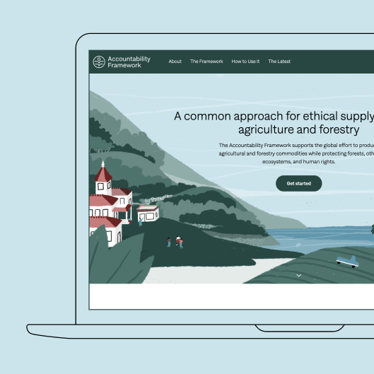
        

          <h3 class="list-mc__title">Accountability Framework Initiative</h3>
          
Providing businesses with information and guidance on how to achieve ethical supply chains free from deforestation, conversion, and human rights violations.

          
<a class="btn" href="https://accountability-framework.org/" target="_blank" rel="noopener">View Site</a>

        

      </li>
      <li class="list-mc__item">
        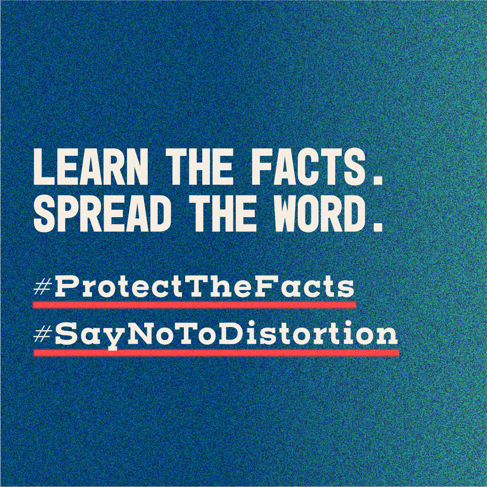
        

          <h3 class="list-mc__title">International Holocaust Remembrance Alliance</h3>
          
Countering Holocaust distortion in collaboration with the European Commission, the United Nations, and UNESCO.

          
<a class="btn" href="https://www.againstholocaustdistortion.org/" target="_blank" rel="noopener">View Site</a>

        

      </li>
      <li class="list-mc__item">
        
        

          <h3 class="list-mc__title">The Clinton Foundation</h3>
          
A philanthropic nonprofit dedicated to expanding economic opportunity, improving public health, confronting the climate crisis, and inspiring citizen engagement and service.

          
<a class="btn" href="https://www.clintonfoundation.org/" target="_blank" rel="noopener">View Site</a>

        

      </li>
      <li class="list-mc__item">
        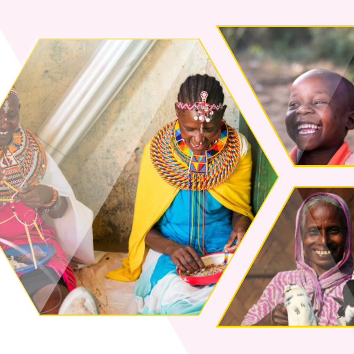
        

          <h3 class="list-mc__title">BRAC UPGI</h3>
          
BRAC (Building Resources Across Communities) is a Bangladeshi international development NGO (and one of the world's largest NGO's). This site is for their Ultra Poor Graduation Initiative empowering millions of people to escape extreme poverty through education.

          
<a class="btn" href="https://bracupgi.org/" target="_blank" rel="noopener">View Site</a>

        

      </li>
      <li class="list-mc__item">
        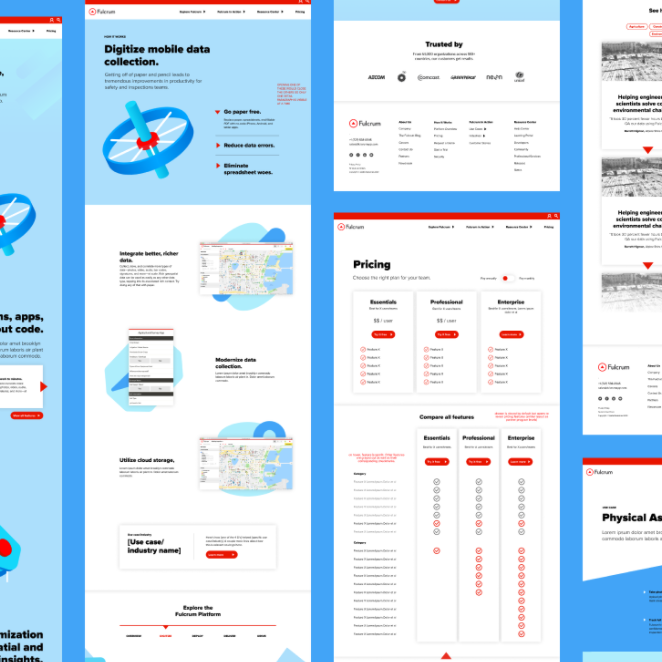
        

          <h3 class="list-mc__title">Fulcrum</h3>
          
A web app that enables businesses to collect field data with no-code mobile apps. These apps can instantly be deployed for use, and collect data without an internet connection.

          
<a class="btn" href="https://www.fulcrumapp.com/" target="_blank" rel="noopener">View Site</a>

        

      </li>
      <li class="list-mc__item">
        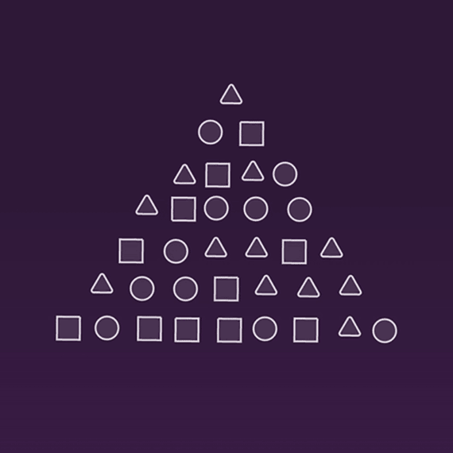
        

          <h3 class="list-mc__title">BigID</h3>
          
An ambitious startup with a first-of-its-kind data intelligence platform supporting companies in consolidating systems, protecting customer data, and achieving compliance with data-protection laws.

          
<a class="btn" href="https://bigid.com/" target="_blank" rel="noopener">View Site</a>

        

      </li>
      <li class="list-mc__item">
        
        

          <h3 class="list-mc__title">Affordable Healthcare Coalition of North Carolina</h3>
          
A nonprofit, nonpartisan, statewide grassroots organization committed to lowering the cost of quality healthcare for businesses, workers, and their families.

          
<a class="btn" href="https://www.affordablecarenc.com/" target="_blank" rel="noopener">View Site</a>

        

      </li>
      <li class="list-mc__item">
        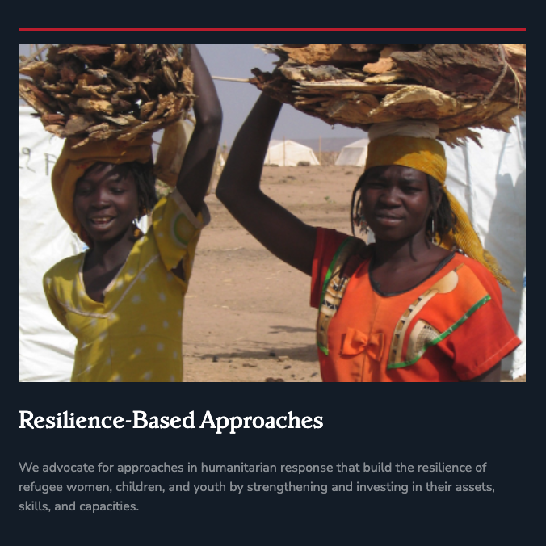
        

          <h3 class="list-mc__title">Women's Refugee Commission</h3>
          
Raising awareness to secure essential funds from the United Nations and beyond.

          
<a class="btn" href="https://www.womensrefugeecommission.org/" target="_blank" rel="noopener">View Site</a>

        

      </li>
      <li class="list-mc__item">
        
        

          <h3 class="list-mc__title">Culture Track</h3>
          
A cultural innovation platform, dedicated to addressing the most pressing challenges facing the worlds of culture and creativity through research, education, dialogue, and action.

          
<a class="btn" href="https://culturetrack.com/" target="_blank" rel="noopener">View Site</a>

        

      </li>
      <li class="list-mc__item">
        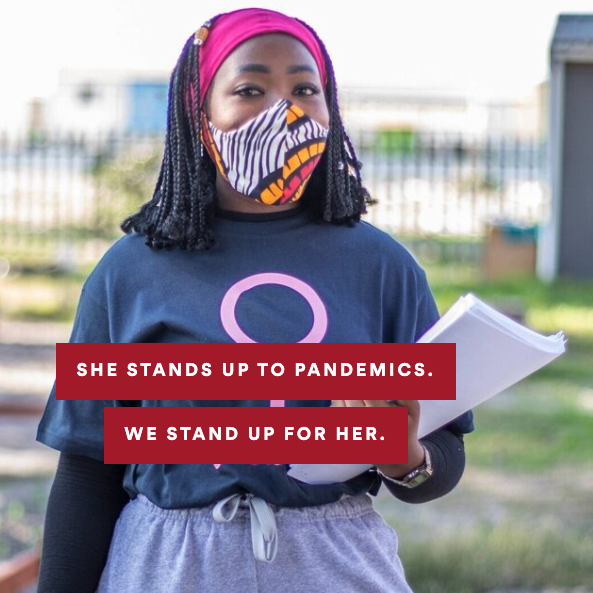
        

          <h3 class="list-mc__title">(RED)</h3>
          
(RED) partners with the world's most iconic brands to support global health and equity.

          
<a class="btn" href="https://www.red.org/" target="_blank" rel="noopener">View Site</a>

        

      </li>
      <li class="list-mc__item">
        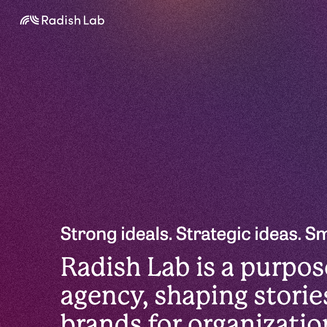
        

          <h3 class="list-mc__title">Radish Lab website</h3>
          
The company I've been a part of for over 6 years. A purpose-driven creative agency in Brooklyn and Berlin.

          
<a class="btn" href="https://www.radishlab.com/" target="_blank" rel="noopener">View Site</a>

        

      </li>
      <li class="list-mc__item">
        
        

          <h3 class="list-mc__title">Edwin Gould Foundation Accelerator</h3>
          
The EGF Accelerator is a long-term nonprofit incubator working to improve educational equity in New York City.

          
<a class="btn" href="https://www.egfaccelerator.org/" target="_blank" rel="noopener">View Site</a>

        

      </li>
      <li class="list-mc__item">
        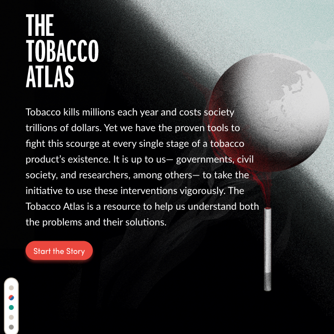
        

          <h3 class="list-mc__title">Tobacco Atlas</h3>
          
A leading resource on tobacco use and its impact on world health created for the American Cancer Society.

          
<a class="btn" href="https://tobaccoatlas.org/" target="_blank" rel="noopener">View Site</a>

        

      </li>
      <li class="list-mc__item">
        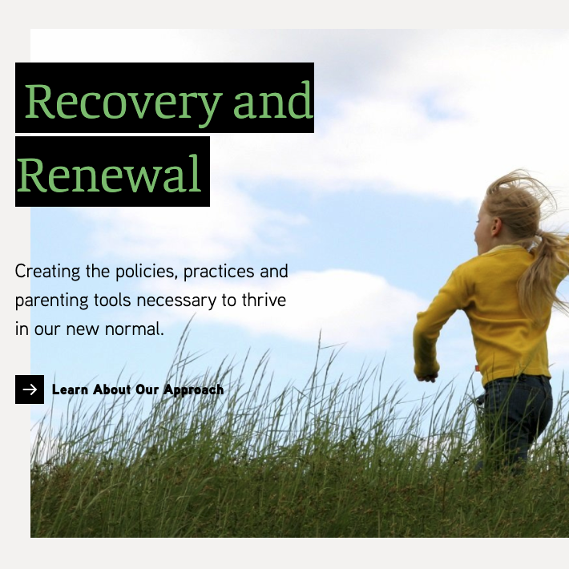
        

          <h3 class="list-mc__title">FOSI</h3>
          
Family Online Safety Institute is a framework for analysis and information regarding online safety for kids and their families around the world, FOSI provides both policymakers and parents with the tools, information, and resources to make informed decisions.

          
<a class="btn" href="https://www.fosi.org/" target="_blank" rel="noopener">View Site</a>

        

      </li>
      <li class="list-mc__item">
        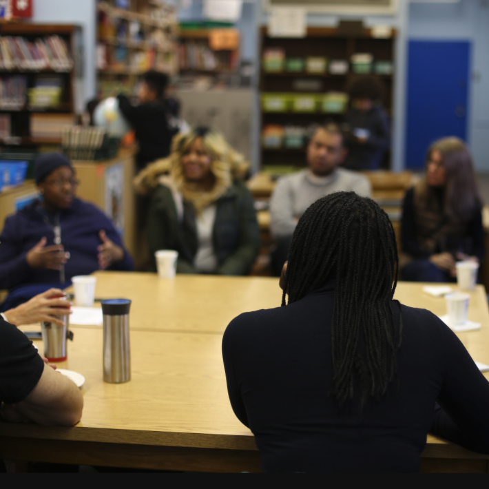
        

          <h3 class="list-mc__title">InsideSchools</h3>
          
Providing independent evaluations, comparisons, and insight into New York City public schools as well as information about the New York City Department of Education.

          
<a class="btn" href="https://insideschools.org/" target="_blank" rel="noopener">View Site</a>

        

      </li>
      <li class="list-mc__item">
        
        

          <h3 class="list-mc__title">Enodo Rights</h3>
          
Deploying legal expertise to analyze corporate social impacts through a human rights lens.

          
<a class="btn" href="https://www.enodorights.com/" target="_blank" rel="noopener">View Site</a>

        

      </li>
      <li class="list-mc__item">
        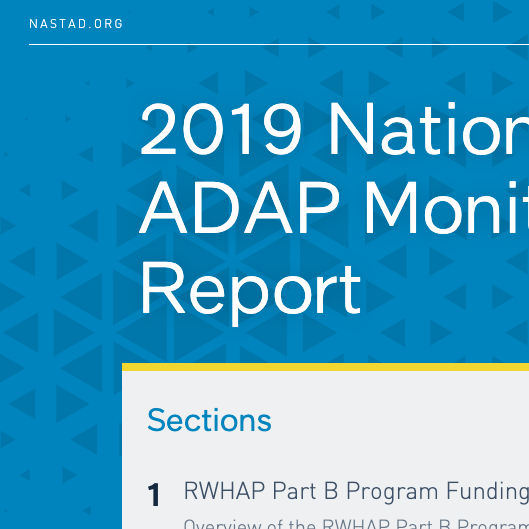
        

          <h3 class="list-mc__title">NASTAD Annual Report</h3>
          
Annual impact report for the National Alliance of State and Territorial AIDS Directors

          
<a class="btn" href="https://publications.partbadap-2019.nastad.org/" target="_blank" rel="noopener">View Site</a>

        

      </li>
      <li class="list-mc__item">
        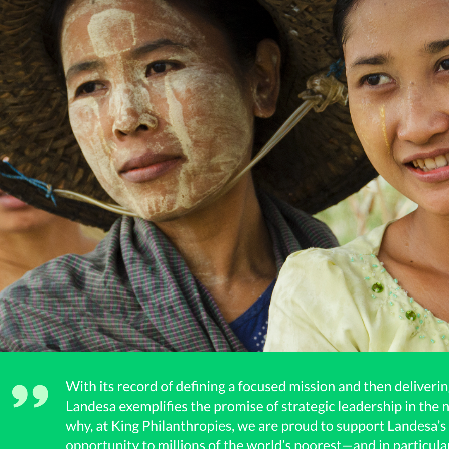
        

          <h3 class="list-mc__title">Landesa Annual Report</h3>
          
Harnessing land rights to fight global poverty and conflict, strengthening food security, and improving environmental stewardship.

          
<a class="btn" href="https://www.landesa.org/annual-report-2017/" target="_blank" rel="noopener">View Site</a>

        

      </li>
      <li class="list-mc__item">
        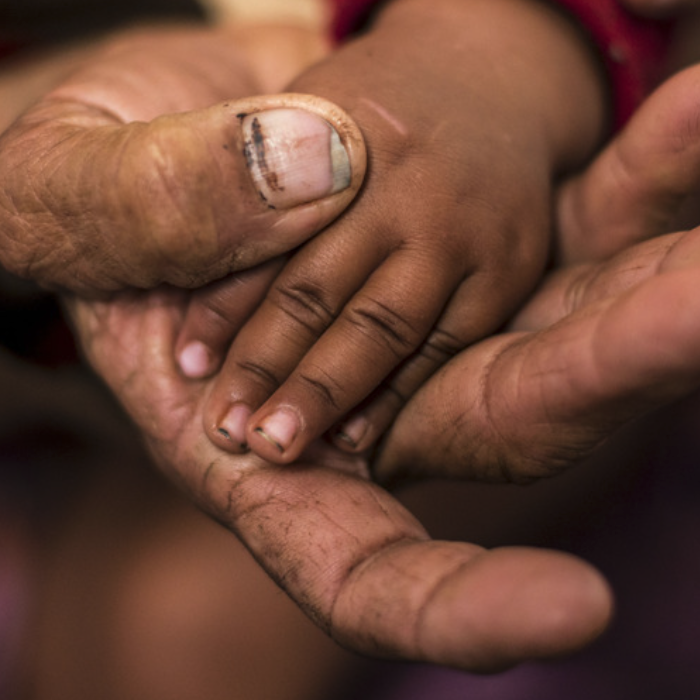
        

          <h3 class="list-mc__title">Humanity United Performance Report</h3>
          
A philanthropic organization and partnership network combating forced labor and human trafficking and dismantling systems of violent conflict and human exploitation around the world.

          
<a class="btn" href="https://www.humanityunited.org/performancereport2014/" target="_blank" rel="noopener">View Site</a>

        

      </li>
      <li class="list-mc__item">
        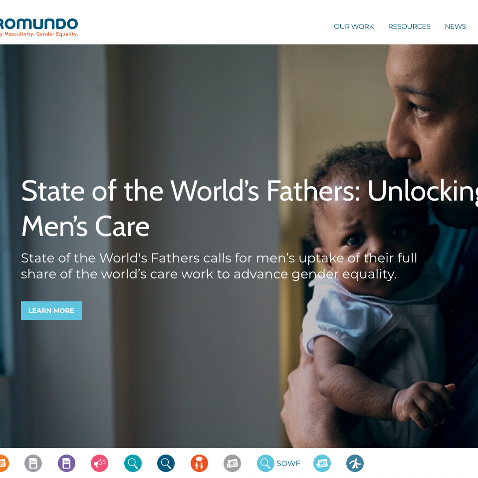
        

          <h3 class="list-mc__title">Promundo</h3>
          
A global leader in advancing gender equality and preventing violence by engaging men and boys in partnership with women, girls, and individuals of all gender identities.

          
<a class="btn" href="https://promundoglobal.org/" target="_blank" rel="noopener">View Site</a>

        

      </li>
      <li class="list-mc__item">
        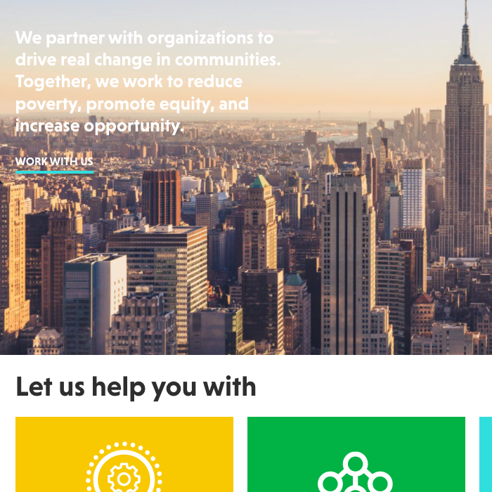
        

          <h3 class="list-mc__title">Community Resource Exchange (CRE)</h3>
          
Partnering with organizations to reduce poverty, promote equity, and increase opportunity.

          
<a class="btn" href="https://www.crenyc.org/" target="_blank" rel="noopener">View Site</a>

        

      </li>
      <li class="list-mc__item">
        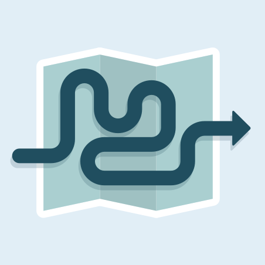
        

          <h3 class="list-mc__title">A Mini Guide to NationBuilder</h3>
          
An overview of the content management and customer relationship software designed for nonprofits, movements, and campaigns.

          
<a class="btn" href="/nationbuilder-guide" target="_blank" rel="noopener">View Site</a>

        

      </li>
    </ul>
  </section>

  

  <section>
    <h2 class="section-title">A Few More Selected Clients</h2>  
    <ul class="basic-list basic-list__ul">
      <li>Alliance for Youth Action</li>
      <li>Center for New York City Neighborhoods</li>
      <li>Global Philanthropy Forum</li>
      <li>National Oceanic and Atmospheric Administration</li>
      <li>Rainforest Alliance</li>
      <li>Research for Action</li>
      <li>Sesame Workshop initiative</li>
      <li>Watershed Agricultural Council / Pure Catskills</li>
    </ul>
  </section>

